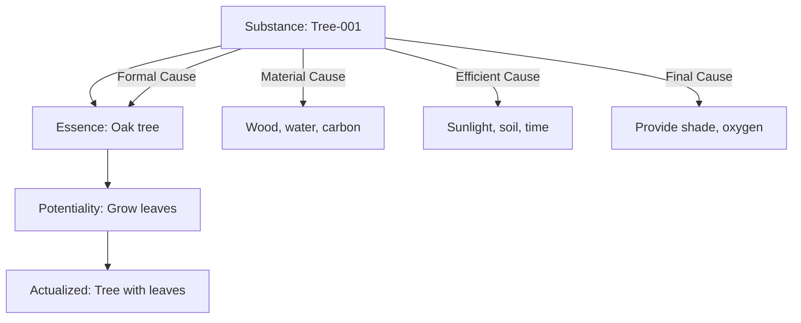

# Ontology-as-a-Service (OaaS)

**A backend platform in Go that models, queries, and reasons about entities, inspired by Neo-Aristotelian metaphysics (E. J. Lowe’s four-category ontology).**

---

## 📖 Philosophical Background

This project is inspired by **E. J. Lowe (1945–2014)**, a leading Neo-Aristotelian metaphysician.  
Lowe developed a **Four-Category Ontology**, reviving and formalizing Aristotelian ideas for contemporary analytic philosophy.  

In his system, reality is structured around:  

1. **Substances** – independent entities (e.g., a tree, a person).  
2. **Kinds** – natural classifications (e.g., oak, human).  
3. **Attributes** – general properties (e.g., color, weight).  
4. **Modes** – particular ways a substance instantiates an attribute (e.g., *this tree’s green leaf*).  

This project translates these categories into a modern **knowledge graph backend**, with APIs to create, relate, and query them. It also integrates Aristotelian notions of **essence, potentiality/actuality, and the four causes (material, formal, efficient, final).**

---

## 🚀 Features

- **Entity Modeling**  
  - Substances, kinds, attributes, and modes as first-class objects.  
  - Go structs and database persistence.  

- **Causal Network**  
  - Store and query causal relations (material, formal, efficient, final).  
  - Track *potentiality → actuality* transitions.  

- **APIs**  
  - REST and GraphQL endpoints.  
  - gRPC for distributed systems.  
  - WebSockets for real-time actualization events.  

- **Storage**  
  - PostgreSQL for structured entities.  
  - Neo4j/Dgraph (optional) for causal graph.  

- **Deployment**  
  - Docker + Kubernetes ready.  
  - Configurable via YAML/JSON.  

---

## 🛠 Tech Stack

- **Language**: Go (Golang)  
- **Framework**: Gin (REST), gqlgen (GraphQL)  
- **Database**: PostgreSQL + Neo4j  
- **Infra**: Docker, Kubernetes, gRPC, WebSockets  

---

## 📂 Project Structure

```
oaas/
│── cmd/
│   └── server/         # Main Go server
│── internal/
│   ├── entities/       # Go structs (Substances, Attributes, Modes, etc.)
│   ├── causality/      # Potentiality → Actuality engine
│   ├── persistence/    # DB layer
│   └── api/            # REST + GraphQL handlers
│── migrations/         # SQL migrations
│── docker/             # Docker/K8s configs
│── configs/            # App configs
│── tests/              # Unit + integration tests
│── README.md
│── go.mod
│── Dockerfile
```

---

## 📌 Example API Usage

### Create a Substance
```bash
POST /api/v1/entities
{
  "name": "Tree-001",
  "kind": "Oak",
  "essence": "Living organism with potentiality for growth"
}
```

### Retrieve Four Causes
```bash
GET /api/v1/causes/Tree-001
```

Response:
```json
{
  "material": "Wood, water, carbon",
  "formal": "Oak tree essence",
  "efficient": "Growth from seed + sunlight + soil",
  "final": "Provide shade, oxygen, ecosystem role"
}
```

### Actualize a Potential
```bash
POST /api/v1/actualize/Tree-001
{
  "potential": "Grow leaves",
  "conditions": ["spring", "sunlight", "water"]
}
```

---

## 🌐 GraphQL Example

```graphql
query {
  substance(id: "Tree-001") {
    name
    kind
    essence
    attributes {
      name
      value
    }
    causes {
      type
      fromEntity
    }
  }
}
```

---

## 🌳 Example Diagram


---

## 🔬 Example Use Cases

- **Knowledge Graphs**: scientific theories, research taxonomies.  
- **Philosophy-in-Tech Demo**: metaphysical concepts mapped into backend design.  
- **Educational Tools**: visualize Aristotle + Lowe’s metaphysics.  
- **AI Reasoning Layer**: plug causal networks into ML/AI reasoning pipelines.  

---

## 📖 References

- E. J. Lowe, *The Four-Category Ontology: A Metaphysical Foundation for Natural Science* (2006).  
- Kit Fine, *Essence and Modality*.  
- David Oderberg, *Real Essentialism*.  

---

## 🧑‍💻 Resume Pitch

**Ontology-as-a-Service (OaaS)** – Backend system in **Go** implementing **E. J. Lowe’s Neo-Aristotelian Four-Category Ontology**.  
- Modeled substances, kinds, attributes, and modes with Postgres/Neo4j.  
- Built a reasoning engine for potentiality → actuality transitions.  
- Designed REST + GraphQL APIs for querying entities and Aristotelian causes.  
- Deployed with Docker + Kubernetes; supports gRPC + WebSockets.  
- Bridges **philosophy and distributed backend design** in a unique way.  